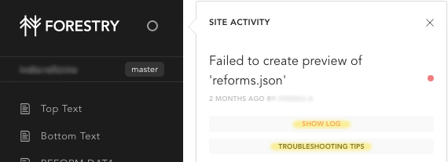

# Build Status

Once you "publish" your work on Forestry, you can view the status of your website building below. Once you see "Success", your updates have been published on your website. 

## Status

## Status Guide

Building = The update is in progress. Please do not publish again until this changes to one of the other statuses.  
Success = The site has been updated. Your updates have now been published on your website.  
Failed = The update did not publish. 

## Troubleshooting tips

Usually when a build fails, it's because content is improperly formatted.  To see what is causing the issue do the following.
- Click on Site Activity (Circle next to the logo in the top left corner)  

  

- If available, click on "Show Log" and review the error message provided by Forestry to determine the error.

  

- Go to the incorrect content and make any necessary adjustments
- Click "Save"
- Review the build status to confirm "Success"

If this does not solve the problem, please contact the iLab for support.  